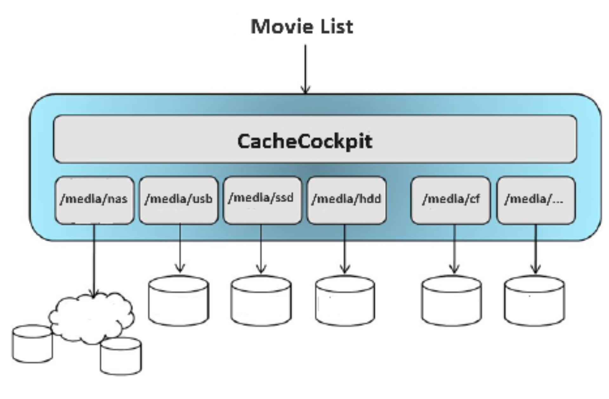

# CacheCockpit (CAC)

## Features
- CAC implements a multimedia cache feature based on an sql database that is used e.g. by MovieCockpit
- CAC combines movie directories (enigma2 bookmarks) residing on different medias (hdd, sd, nas) to one virtual file system

## Limitations
- CAC supports DreamOS only
- CAC is being tested on DM 920 and DM ONE only

## Installation
CAC will be installed/removed automatically as a dependency. No explicit installation necessary.

## Links
- Support: https://github.com/dream-alpha/CacheCockpit/discussions
